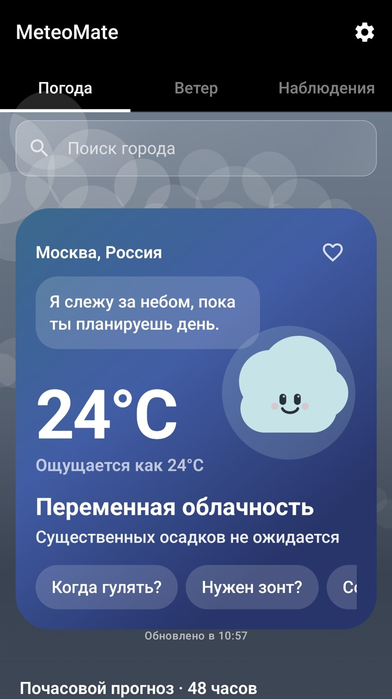
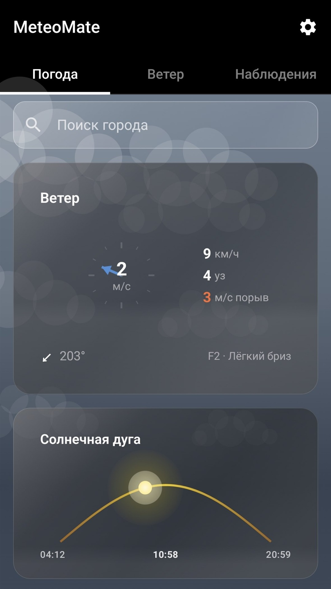
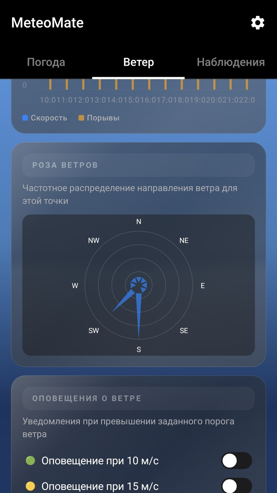

<div align="center">
  
  <h1>MeteoMate</h1>
  <p>An Android weather companion with detailed forecasts, wind analysis, and helpful alerts.</p>
  <p>
    <a href="https://www.rustore.ru/catalog/app/com.example.meteomate"><strong>Download on RuStore</strong></a>
  </p>
</div>

## About

MeteoMate helps you understand not only the temperature, but also how the weather may affect your day. It provides hourly and seven-day forecasts, air quality, solar and geomagnetic conditions, plus a dedicated section with detailed wind data.

## Features

- current conditions, feels-like temperature, and a 48-hour forecast;
- seven-day forecast and forecast records for the selected city;
- wind speed, direction, gusts, wind rose, and weather model comparison;
- ECMWF, GFS, ICON, NAM, HRRR, WRF, AROME, and other models;
- air quality, UV index, and a sun-protection timer;
- sunrise, sunset, golden hour, and a lunar calendar;
- current Kp index and geomagnetic activity forecast;
- weather alerts, quiet hours, and strong-wind notifications;
- home-screen widget with temperature, precipitation, and wind;
- favorite cities, geolocation, and offline forecast caching.

## Screenshots

<p align="center">
  
  
  
</p>

## Installation

Download the ready-to-use app from [RuStore](https://www.rustore.ru/catalog/app/com.example.meteomate).

Building from source requires Android Studio, JDK 17, and Android SDK 35.

1. Clone the repository.
2. Copy `secrets.properties.example` to `secrets.properties`.
3. Add your OpenWeather API key as `WEATHER_API_KEY`.
4. Open the project in Android Studio or run:

```powershell
.\gradlew.bat assembleDebug
```

The debug APK will be generated in `app/build/outputs/apk/debug/`.

## Tech stack

- Kotlin and Jetpack Compose;
- Material 3;
- Hilt;
- Retrofit and Gson;
- Room and DataStore;
- WorkManager;
- OpenWeather, Open-Meteo, and NOAA SWPC.

## Security

Never commit `secrets.properties`, signing keys, passwords, or built APK files. These files are already excluded by `.gitignore`.

## Version

The current project version is **1.6.1**. The minimum supported Android version is **7.0 (API 24)**.
